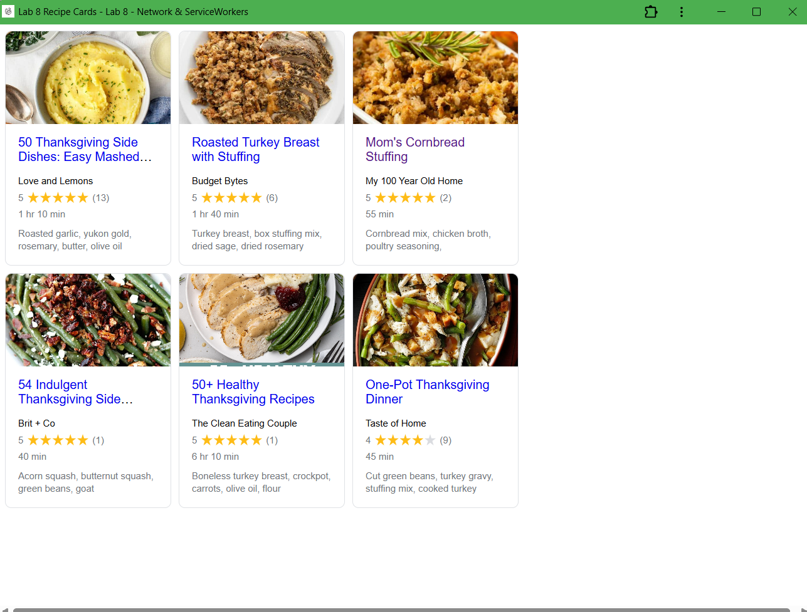

# Lab8-Starter

## Lab Partner(s)
- Abdirahman Mohamed

## Deployed GitHub Pages URL
[https://your-username.github.io/Lab8_Starter](https://your-username.github.io/Lab8_Starter)  
_(Replace `your-username` with your actual GitHub username)_

## Graceful Degradation and Service Workers

Graceful degradation ensures that a web application still works even when some advanced features are not supported or fail. Service workers directly support this concept by allowing the application to function offline or under poor network conditions. For example, even if the user loses internet access, service workers can serve cached content so the recipe cards and UI still load. This way, the app degrades gracefully by falling back to stored assets rather than breaking entirely.

## PWA Screenshot

Below is a screenshot of the installed Progressive Web App showing the Thanksgiving recipe cards interface.

